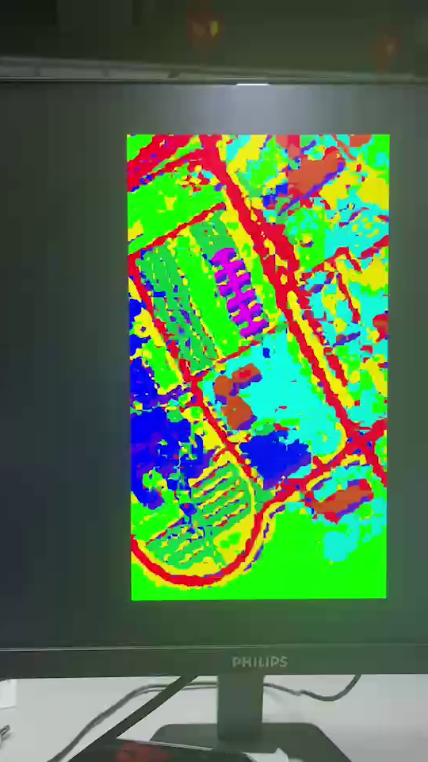

# D1 FPGA hardware

The accelerator implements spatial–spectral Mamba inference through the chain
PCIe → dual bank → Patch → network → DDR labels → HDMI / PCIe C2H.
It includes N0–N3 full-network and local nonlinear comparisons.

[中文](README_zh-CN.md) · [Results](docs/RESULTS.md) · [Dependencies](docs/DEPENDENCIES.md)

## 1. Environment and model

- Windows, Vivado **2025.2** with Kintex UltraScale support, external Python 3.8+.
- Target: `xcku060-ffva1156-2-i` on the ALIENTEK KU060 board.
- A new ASCII build path outside the repository, at most 48 characters, such as
  `D:/fpga/n3_v1`.
- NumPy for the host's NPY label reference.
- Sufficient RAM/disk for full-network jobs. N3 activity collection uses tens of
  GiB of memory and produces roughly 18.8 GB of SAIF data; run these jobs sequentially.

Hardware parameters correspond to **one UP D1 model** and are initialized at build
time. The repository includes RTL, 85 IP configurations, the PCIe block design,
HDMI controller sources, ROM images, regression vectors, the full quantized UP
scene and its integer label reference. Vivado generates IP outputs, DCPs and
bitstreams. The build reads the exported ROM images in `models/up_d1/`; the
training checkpoint is an input to parameter export. The Windows XDMA driver is
installed from the board support package.

A different checkpoint requires a complete parameter export as described in the
[data contract](docs/DATA_CONTRACT.md). Software evaluations across four datasets
use their respective trained checkpoints.

## 2. Check the source package

Run from the repository root:

```bat
python hardware/run.py check
python -m unittest discover -s hardware/tests -v
```

The manifest binds source, configuration, initialization, vector and script files
to their hashes. Each build gets a `package/` snapshot and its own fingerprint.
Simulation and build results refer to that fingerprint.

## 3. Full-network simulation and implementation

Set `VIVADO_BAT` to the installed Vivado executable. In Windows CMD:

```bat
set VIVADO_BAT=C:\Xilinx\2025.2\Vivado\bin\vivado.bat
python hardware/run.py prepare N3 D:/fpga/n3_v1
python hardware/run.py sim D:/fpga/n3_v1
python hardware/run.py build D:/fpga/n3_v1
```

`prepare` creates an independent project. `sim` checks 16 different input
tiles against N3-specific software logits: 2304 bytes, stream boundaries,
context alignment and II=4096. `build` writes synthesis reports/DCP, then
routing and split register/port timing reports. The top is `nl_fullnet_shell`;
this flow implements the inference fabric.

Use N0, N1 or N2 in place of N3 with a separate build directory for each method.
Each method uses its corresponding reference logits. N2 uses a static-selection
coefficient wrapper. The configured N0/N1/N2 designs exceed KU060 DSP capacity;
their build flow produces synthesis resource reports and stops at the capacity
check.

For a staged package followed by separate Vivado project creation:

```bat
python hardware/run.py prepare N3 D:/fpga/n3_stage --stage-only
python hardware/run.py create D:/fpga/n3_stage
```

The first command copies and checks files; the second starts Vivado.
XSim uses `-nosignalhandlers`, starts at 0 ns, and executes one `run all`
through `$finish`. `actual_logits.csv` begins when the first output is emitted.

## 4. PCIe–DDR–HDMI board chain

The board profile selects the HDMI controller sources in `vendor/hdmi/`.
An alternative location can be selected with `--vendor-dir PATH`.

```bat
python hardware/run.py prepare board D:/fpga/board_v1
python hardware/run.py sim D:/fpga/board_v1
python hardware/run.py build D:/fpga/board_v1
```

The default board test (`REAL_FIVE=0`) repeats the first D1 tile five times and
checks the network, integer interpolation/argmax, behavioral DDR, HDMI path and
C2H page buffer. The testbench also supports `REAL_FIVE=1`, which reads the first
five different scene tiles from `board/sim/real5_input_128b.mem` and the matching
logits from `board/sim/real5_expected_logits_chw.mem`. `scripts/sim.tcl` selects
`REAL_FIVE=0` for the standard board flow. The full-network test in section 3
provides the 16-different-tile logit check. PCIe PHY operation is exercised on
the board.

The board top is `up_pcie_network_hdmi_top`, the implementation run is
`d1_impl`, and the output is
`D:/fpga/board_v1/up_pcie_network_hdmi_D1.bit`.
The build writes timing, DRC, clock-domain-crossing and routing reports; bitstream
generation requires passing observed setup/hold checks.

Program the bitstream using Vivado Hardware Manager, confirm XDMA **AXI-MM**
enumeration and reset the board. From the repository root, send the supplied
scene and compare the DDR labels:

```bat
python hardware/host/send_scene_v2.py --scene hardware/models/up_d1/scene/scene_tiles_uint8.bin --expected-labels evidence/completion_20260923/nonlinear_D1/n3_prediction_rtl_integer.npy --require-ii4096 --output D:/results/board_test_01
```

The sender operates on a programmed, reset E2/D1 design. It writes both 64-KiB
input banks, starts inference, and reads all 207400 labels. E2 identifies the
control protocol; the D1 parameters are part of the bitstream.
Use `--device-index` to select among multiple devices.
The output directory contains `report.json`, `labels_u8.bin` and
`prediction.ppm`. With a matching reference the sender reports `PASS`;
without `--expected-labels` it reports `READBACK_OK_REFERENCE_NOT_CHECKED`.

## 5. Local coefficient/D-readout ablations

```bat
vivado -mode batch -source hardware/nonlinear/run.tcl -tclargs sim N3 blk0_spa D:/fpga/nl_sim 1
vivado -mode batch -source hardware/nonlinear/run.tcl -tclargs sim N2 blk0_spa D:/fpga/n2_sim 1
vivado -mode batch -source hardware/nonlinear/run.tcl -tclargs d1sim N3 blk0_spa D:/fpga/d_sim 1
vivado -mode batch -source hardware/nonlinear/run.tcl -tclargs build N3 blk0_spa D:/fpga/n3_ooc 1
```

For `build`, the last argument selects coefficient core only (0) or coefficient
core plus common D-readout adapter (1). The full network uses D1.
The `sim N3` entry checks N0/N1/N3 together; N2 and D readout use separate
testbenches. Other cores are `blk0_spe`, `blk1_spa`, `blk1_spe`,
`blk2_spa` and `blk2_spe`. OOC results describe the selected local core.

## 6. Power

After N3 simulation and routing, follow [POWER.md](docs/POWER.md).
The workflow performs a registration probe, captures post-route functional
activity, and generates Vivado reports. The supplied estimate is 6.386 W for
the inference fabric at 100 MHz, typical process and 50 °C, with 71% design-net
activity matching. Measurement conditions and component values are in
[RESULTS.md](docs/RESULTS.md).

## 7. Directory map

| Directory | Contents |
|---|---|
| `rtl/network`, `rtl/board` | Network and board RTL/include files |
| `ip/config`, `board` | IP configurations, PCIe BD and board constraints |
| `vendor/hdmi` | HDMI I2C controller and device configuration |
| `models/up_d1` | ROM images, 16-tile vectors, full-scene input and model metadata |
| `fullnet/variants` | N0–N3 variant sources |
| `nonlinear` | Local coefficient and D-readout simulations/OOC builds |
| `scripts`, `run.py` | Project creation, simulation and build |
| `host` | Windows XDMA scene sender and DDR label readback |
| `power` | Post-route functional activity capture and power reporting |
| `evidence` | Resource, timing, power and board reports |
| `docs/images` | Architecture, tile schedule and HDMI photograph |



The photograph shows the board's HDMI classification output.
[Validation workflow](docs/VALIDATION.md) lists source, simulation and board checks.
