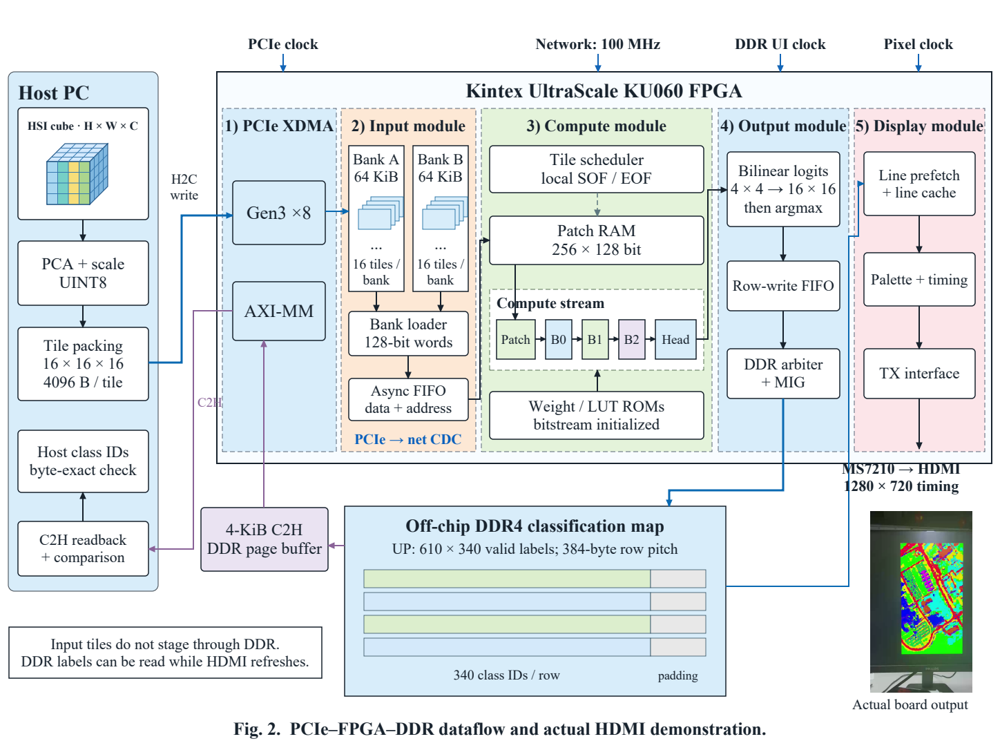

# D1 FPGA 硬件说明

硬件实现空间—光谱 Mamba 推理，数据链路为
PCIe → 双 bank → Patch → 推理网络 → DDR 标签 → HDMI 显示 / PCIe 回读，
并包含 N0–N3 全网与局部非线性计算对照实验。

[English](README.md) · [实验结果](docs/RESULTS.md) · [依赖说明](docs/DEPENDENCIES.md)

## 1. 环境与模型

- Windows、Vivado **2025.2**、Kintex UltraScale 器件支持、外部 Python 3.8+。
- 目标器件为正点原子 KU060 板卡上的 `xcku060-ffva1156-2-i`。
- 构建目录使用仓库外的新目录，路径为 ASCII，长度不超过 48 字符，
  例如 `D:/fpga/n3_v1`。
- 主机读取 NPY 标签参考需要 NumPy。
- 全网构建与功耗采集顺序运行；N3 活动采集需要数十 GiB 内存，
  SAIF 文件约为 18.8 GB。

硬件参数对应一个 **UP D1 模型**，在构建时初始化。
仓库提供 RTL、85 份 IP 配置、PCIe BD、HDMI 控制源码、ROM、
16-tile 回归向量、完整量化场景和整数标签参考。
Vivado 生成 IP 产物、DCP 和 bitstream。硬件构建读取 `models/up_d1/` 中
已导出的 ROM；训练 checkpoint 用于参数导出。Windows XDMA 驱动由板卡
支持包安装。

其他 checkpoint 需要按 [数据协议](docs/DATA_CONTRACT.md) 导出完整参数。
软件四数据集实验分别使用各自训练得到的 checkpoint。

## 2. 文件与依赖检查

在仓库根目录执行：

```bat
python hardware/run.py check
python -m unittest discover -s hardware/tests -v
```

文件清单记录源码、配置、初始化数据、向量和脚本的哈希。
每个构建目录包含独立的 `package/` 快照及指纹，仿真与构建结果对应该指纹。

## 3. 全网仿真与实现

在仓库根目录的 Windows CMD 中运行，安装路径按本机设置：

```bat
set VIVADO_BAT=C:\Xilinx\2025.2\Vivado\bin\vivado.bat
python hardware/run.py prepare N3 D:/fpga/n3_v1
python hardware/run.py sim D:/fpga/n3_v1
python hardware/run.py build D:/fpga/n3_v1
```

`prepare` 建立独立工程；`sim` 检查 16 个不同真实 tile、2304 个 logit
字节、流边界、context 对齐和 II=4096；`build` 输出综合报告与 DCP，
随后执行布线并生成寄存器/端口分类时序报告。
主模块为 `nl_fullnet_shell`，实现范围为推理计算部分。

替换 N3 为 N0、N1 或 N2，并分别指定新目录即可运行其他方法。
各方法使用对应的独立软件参考；N2 使用静态选择系数模块。
当前并行度下 N0/N1/N2 的 DSP 超出 KU060 容量，N0/N2 的 LUT 也超容；
构建在综合后保留资源报告，并于容量检查处结束。

分开执行文件准备与 Vivado 工程创建：

```bat
python hardware/run.py prepare N3 D:/fpga/n3_stage --stage-only
python hardware/run.py create D:/fpga/n3_stage
```

第一条命令复制并检查文件，第二条命令启动 Vivado。
XSim 使用 `-nosignalhandlers`，从 0 ns 执行一次 `run all` 到
`$finish`；第一个输出产生后开始写入 `actual_logits.csv`。

## 4. 上板链路

board 配置默认读取 `hardware/vendor/hdmi/` 中的三个 HDMI 控制文件；
`--vendor-dir PATH` 可指定其他目录。

```bat
python hardware/run.py prepare board D:/fpga/board_v1
python hardware/run.py sim D:/fpga/board_v1
python hardware/run.py build D:/fpga/board_v1
```

板级 testbench 默认使用 `REAL_FIVE=0`，将 D1 的第一个 tile 重复五次，
检查推理网络、整数插值/argmax、行为级 DDR、HDMI 和 C2H 页缓存。
`REAL_FIVE=1` 分支使用场景中的前五个不同 tile，输入和对应 logit 分别
位于 `board/sim/real5_input_128b.mem` 和
`board/sim/real5_expected_logits_chw.mem`。标准板级流程由
`scripts/sim.tcl` 设置 `REAL_FIVE=0`。第 3 节的全网测试检查 16 个不同
tile 的 logit，PCIe PHY 在板卡上运行。

主模块为 `up_pcie_network_hdmi_top`，实现 run 为 `d1_impl`，
输出为 `D:/fpga/board_v1/up_pcie_network_hdmi_D1.bit`。
构建同时输出时序、DRC、跨时钟域和布线报告；观测到的 setup/hold
检查通过后生成 bitstream。

通过 Vivado Hardware Manager 下载 bitstream，确认 XDMA **AXI-MM**
枚举并复位板卡。在仓库根目录发送场景、回读并比较标签：

```bat
python hardware/host/send_scene_v2.py --scene hardware/models/up_d1/scene/scene_tiles_uint8.bin --expected-labels evidence/completion_20260923/nonlinear_D1/n3_prediction_rtl_integer.npy --require-ii4096 --output D:/results/board_test_01
```

发送器要求板卡已加载 E2/D1 设计并处于复位后的初始状态。
它写入两个 64-KiB 输入 bank，启动推理并回读 207400 个标签。
E2 表示控制协议，D1 参数包含在 bitstream 中。
多设备环境下使用 `--device-index` 选择设备。

输出目录包含 `report.json`、`labels_u8.bin` 和 `prediction.ppm`。
参考标签全部一致时结果为 `PASS`；省略 `--expected-labels` 时结果为
`READBACK_OK_REFERENCE_NOT_CHECKED`。

## 5. 局部消融与功耗

局部系数核、D 读出和 OOC 构建命令见
[英文说明第 5 节](README.md#5-local-coefficientd-readout-ablations)。
OOC 构建的末参数 0 表示系数核，1 表示系数核加公共 D 读出适配器；
全网配置使用 D1。

N3 完成仿真和布线后，按 [功耗流程](docs/POWER.md) 顺序运行
probe、capture 和 report。功耗使用布线后功能仿真活动，由 Vivado 估算。
已提供结果为 100 MHz、typical process、50 °C 下推理计算部分的
6.386 W，设计网活动匹配率约 71%。

## 6. 文件入口

| 路径 | 内容 |
|---|---|
| `rtl/network`、`rtl/board` | 推理网络与板级 RTL |
| `ip/config`、`board` | IP 配置、PCIe BD 和板级约束 |
| `vendor/hdmi` | HDMI I2C 控制与器件配置 |
| `models/up_d1` | ROM、回归向量、完整场景输入和模型元数据 |
| `fullnet/variants`、`nonlinear` | 全网方法对照与局部计算实验 |
| `run.py`、`scripts` | 工程创建、仿真和构建 |
| `host` | XDMA 场景发送与标签回读 |
| `power` | 活动采集与功耗报告 |
| `evidence` | 资源、时序、功耗报告和板级运行数据 |

[数据排列与协议](docs/DATA_CONTRACT.md) · [实验结果](docs/RESULTS.md) ·
[检查与仿真流程](docs/VALIDATION.md)




