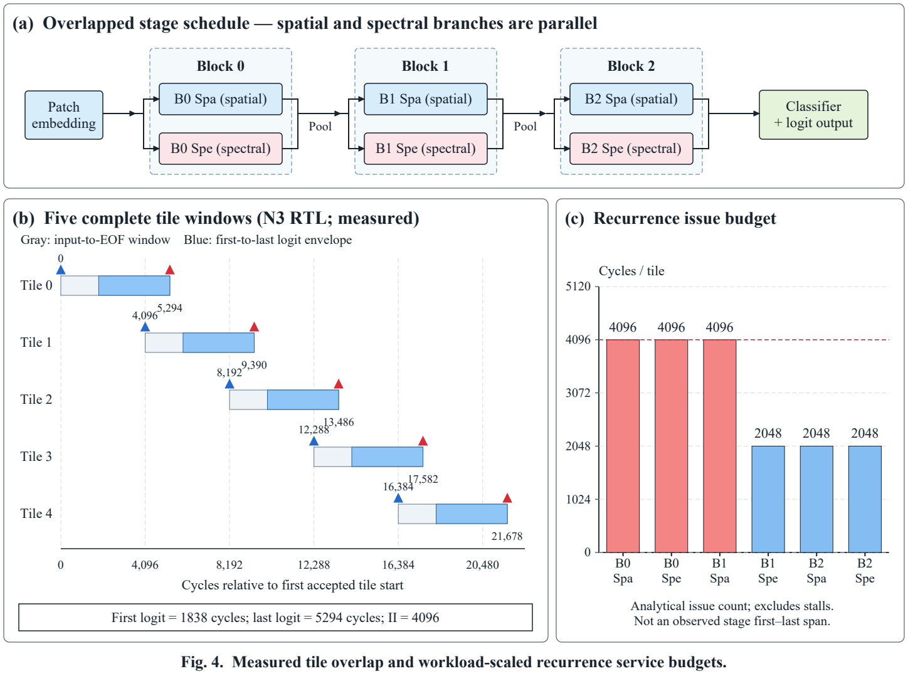

# Hardware results

The tables describe the UP D1 implementation on `xcku060-ffva1156-2-i`.
Vivado resource/timing/power reports and the board scene report are in
[evidence](../evidence). Each result uses the configuration and test workload
specified below.

## Full D1 inference fabric

All methods use a 100-MHz clock target and the same network parallelism.

| Method | Synthesis LUT | FF | DSP | BRAM36 equivalent | KU060 capacity |
|---|---:|---:|---:|---:|---|
| N0 | 2,604,812 | 371,465 | 5,053 | 660 | LUT/DSP exceed capacity |
| N1 | 252,338 | 210,129 | 4,345 | 660 | DSP exceeds capacity |
| N2 | 402,614 | 225,000 | 4,944 | 660 | LUT/DSP exceed capacity |
| N3 synthesis | 165,519 | 172,179 | 2,192 | 738 | Fits |
| N3 routed | 155,003 | 171,958 | 2,192 | 692 | Meets the 100-MHz fabric timing model |

N3 setup/hold slack is 1.159/0.030 ns for register-to-register paths,
3.036/0.065 ns for port-to-register paths, and 4.345/1.127 ns for
register-to-port paths. There is no port-to-port path. All twelve
`check_timing` categories are zero. These values use the fabric interface
constraints; the board and OOC coefficient-core flows use separate constraints.

| Method | First logit after accepted start (cycles) | Last logit (cycles) | Steady tile II |
|---|---:|---:|---:|
| N0 | 2012 | 5468 | 4096 |
| N1 | 1871 | 5327 | 4096 |
| N2 | 1874 | 5330 | 4096 |
| N3 | 1838 | 5294 | 4096 |

Each full-network RTL regression compares 16 different tiles, 2304 logit
bytes/18432 bits, against its method-specific independent software reference.
The arithmetic differences between methods are quantified in the fidelity
table below. N1/N2 adapt nonlinear arithmetic methods within this D1 network.
Their capacity results apply to the configured parallelism.

## N3 power estimate

Vivado reports **6.386 W total = 5.447 W dynamic + 0.939 W static** for the routed
N3 inference fabric under these conditions:

| Setting | Value |
|---|---|
| Clock | 100 MHz |
| Process / junction temperature | Typical / 50 °C |
| Activity source | Post-route functional simulation |
| Warmup / activity window | 9216 / 32768 cycles |
| Window duration | 327680 ns |
| Functional check | 16 different tiles through final PASS |
| Matched design nets | 453380/638590 (about 71%) |

Unmatched nets use propagated/default activity. The functional simulation has
no SDF timing back-annotation. PCIe, DDR and HDMI are outside the inference-fabric
design. At 4096 cycles/tile, the steady-state power/throughput ratio is
261.6 µJ/tile total and 223.1 µJ/tile dynamic.

The N0/N1/N2 flow ends at the synthesis capacity check and provides resource
results at this parallelism. N3 provides routed timing and power results. The N3
figure is a Vivado on-chip estimate; GPU NVML values describe GPU device power
under their own measurement conditions.

## Board-level D1

The PCIe/DDR/HDMI build uses 198608 LUT, 225509 FF, 2197 DSP and 815 BRAM36
equivalents. Setup/hold slack is +0.034/+0.030 ns.

The [full-scene board test](../evidence/board/scene_report.json) records:

| Item | Result |
|---|---|
| Input scene | UP, 858 tiles |
| DDR labels compared | 207400 |
| Integer-reference label mismatches | 0 |
| Minimum / maximum tile II | 4096 / 4096 cycles |
| Display underflow | None observed during this run |

The hardware counters provide the tile interval. The report's 0.032-s host
duration field is shorter than the interval-derived scene duration at 100 MHz,
so throughput in this table is specified by the FPGA cycle counts.
The full-scene comparison observes final labels; the 16-tile RTL test observes
logits and stream behavior.

## End-to-end numerical fidelity

For the fixed UP D1 checkpoint, relative to N3:

| Method | Different logits /123552 | Logit MAE | RMSE | Max LSB | Different labels /207400 |
|---|---:|---:|---:|---:|---:|
| N0 | 17 | 0.000138 | 0.011730 | 1 | 0 |
| N1 | 53229 | 0.469551 | 0.743519 | 5 | 9371 (4.5183%) |
| N2 | 67698 | 0.652260 | 0.944216 | 6 | 13412 (6.4667%) |
| N3 | 0 | 0 | 0 | 0 | 0 |

Logit and label differences measure numerical fidelity. Dataset OA measures
classification accuracy against ground-truth labels. The corresponding arrays
and metrics are in
[evidence/completion_20260923/nonlinear_D1](../../evidence/completion_20260923/nonlinear_D1).

